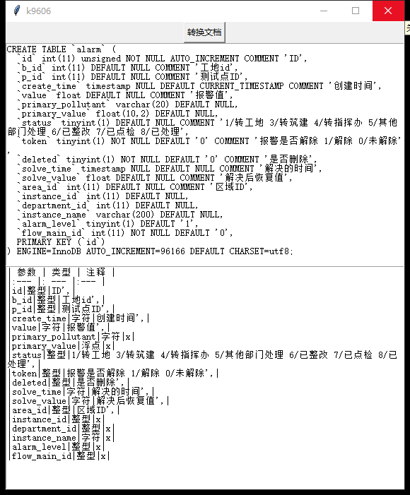

### 表结构文档转换器 🌶🐤

- 在上边粘贴表结构, 下边就可以生成 md 文档啦
- 基于 python3, 依赖在 Pipfile 中

- 使用方法:

```
python md.py
```

- 打包 exe 方法:

```
pyinstaller -F --icon=./libraries/images/logo.ico -w md.py
```

- exe 文件下载链接:

[点此下载 md.exe](./libraries/apps/md.exe)



